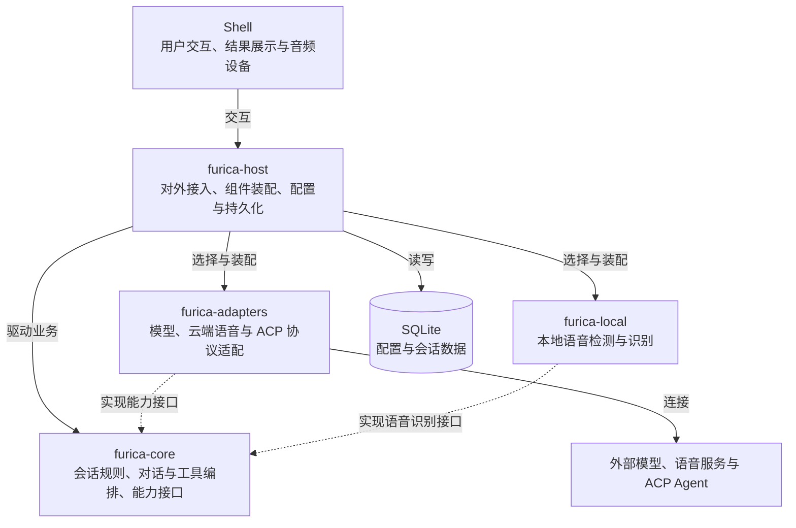
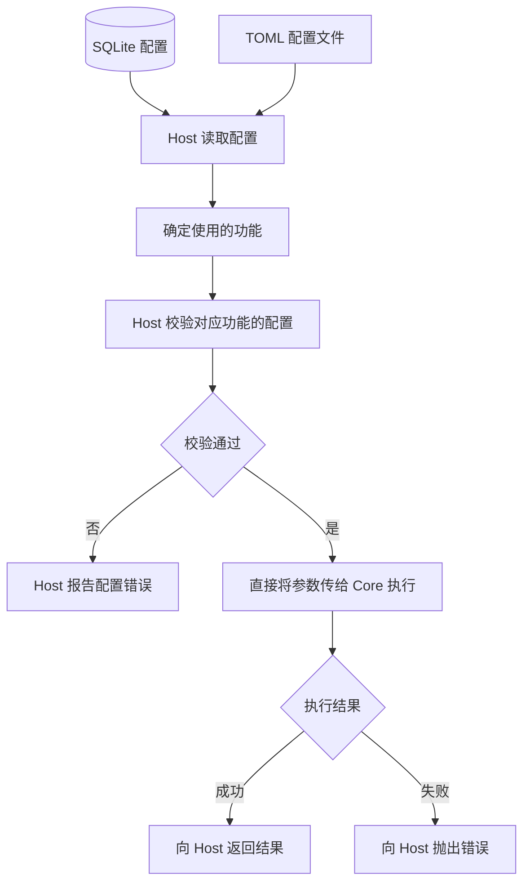

# 模块总览图

```mermaid
flowchart TD
    shell["Shell<br/>用户交互、结果展示与音频设备"]
    host["furica-host<br/>对外接入、组件装配、配置与持久化"]
    core["furica-core<br/>会话规则、对话与工具编排、能力接口"]
    adapters["furica-adapters<br/>模型、云端语音与 ACP 协议适配"]
    local["furica-local<br/>本地语音检测与识别"]
    storage[("SQLite<br/>配置与会话数据")]
    external["外部模型、语音服务与 ACP Agent"]

    shell -->|"交互"| host
    host -->|"驱动业务"| core
    host -->|"选择与装配"| adapters
    host -->|"选择与装配"| local
    host -->|"读写"| storage
    adapters -.->|"实现能力接口"| core
    local -.->|"实现语音识别接口"| core
    adapters -->|"连接"| external
```

# 数据流设计
## 配置流图

```mermaid
flowchart TD
    sqlite[("SQLite 配置")] --> load["Host 读取配置"]
    toml["TOML 配置文件"] --> load

    load --> feature["确定使用的功能"]
    feature --> validate["Host 校验对应功能的配置"]
    validate --> valid{"校验通过"}

    valid -->|否| configError["Host 报告配置错误"]
    valid -->|是| core["直接将参数传给 Core 执行"]

    core --> result{"执行结果"}
    result -->|成功| success["向 Host 返回结果"]
    result -->|失败| error["向 Host 抛出错误"]
```
